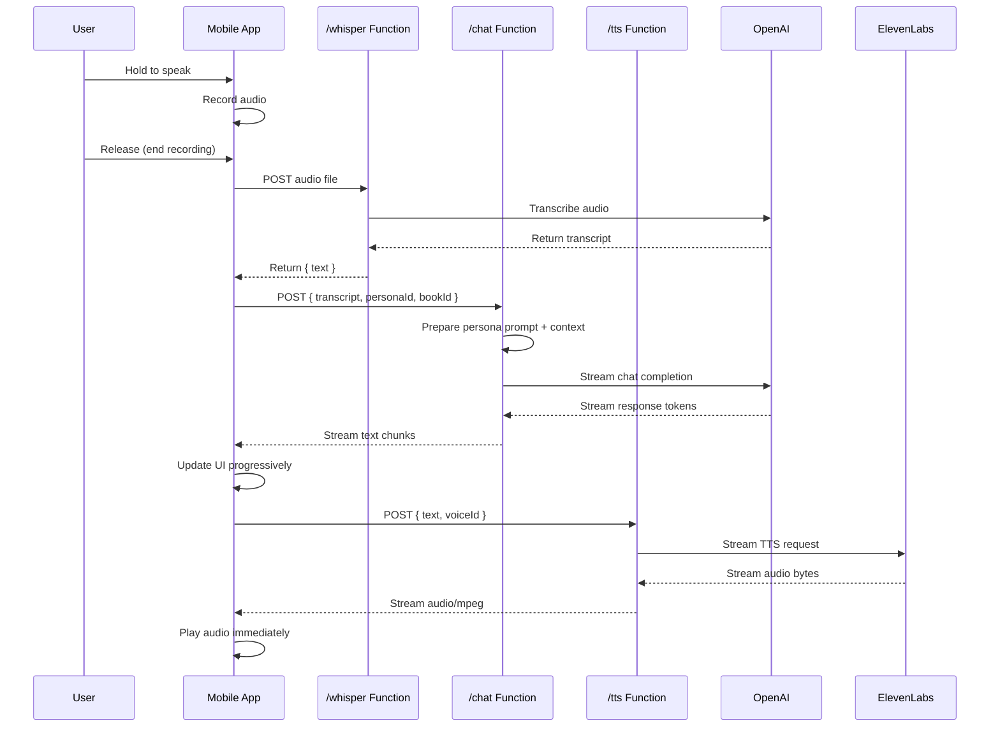

# Design Document

## Overview

The voice conversation loop is the core architecture that enables Inkling's primary user experience: near-instant voice conversations with AI personas about books. The system implements a three-stage pipeline (Speech-to-Text → Chat Generation → Text-to-Speech) with aggressive latency optimization and streaming capabilities.

The architecture follows a client-server model where the React Native mobile app handles UI state and audio playback, while three Supabase Edge Functions handle the AI service integrations. All external API keys are secured server-side, and the mobile app only communicates through authenticated Supabase endpoints.

## Architecture

### High-Level System Flow



### Component Architecture

```mermaid
graph TB
    subgraph "Mobile App (React Native)"
        UI[ConversationScreen]
        Store[Zustand Store]
        API[API Utils]
        Audio[Audio Wrapper]
        Env[Environment Utils]
    end
    
    subgraph "Supabase Edge Functions"
        Whisper[/whisper Function]
        Chat[/chat Function]
        TTS[/tts Function]
    end
    
    subgraph "External Services"
        OpenAI[OpenAI API]
        ElevenLabs[ElevenLabs API]
    end
    
    subgraph "Future Components"
        RAG[RAG Retrieval]
        Usage[Usage Logging]
        RLS[Rate Limiting]
    end
    
    UI --> Store
    UI --> API
    UI --> Audio
    API --> Env
    
    API --> Whisper
    API --> Chat
    API --> TTS
    
    Whisper --> OpenAI
    Chat --> OpenAI
    Chat -.-> RAG
    TTS --> ElevenLabs
    
    Chat -.-> Usage
    Whisper -.-> RLS
    Chat -.-> RLS
    TTS -.-> RLS
```

## Components and Interfaces

### Mobile App Components

#### API Utilities (`utils/api.ts`)
**Purpose**: Centralized API client for all Edge Function communication
**Key Functions**:
- `sttWhisper(fileUri: string): Promise<string>` - Speech-to-text conversion
- `chatLLM(transcript: string, personaId: string, bookId: string, onChunk: (delta: string) => void): Promise<string>` - Streaming chat generation
- `ttsAudioStream(text: string, voiceId: string): Promise<string>` - Text-to-speech conversion

**Implementation Details**:
- Uses AbortController for request cancellation
- Implements exponential backoff retry logic
- Handles streaming responses with ReadableStream API
- Provides typed error handling with specific error codes

#### Audio Wrapper (`utils/audio.ts`)
**Purpose**: Abstract audio playback to enable easy migration from expo-av to expo-audio
**Key Functions**:
- `playAudio(uri: string): Promise<AudioInstance>` - Play audio from URI
- `stopAudio(instance: AudioInstance): Promise<void>` - Stop audio playback
- `pauseAudio(instance: AudioInstance): Promise<void>` - Pause audio playback

**Implementation Details**:
- Hides expo-av/expo-audio implementation details
- Provides consistent error handling across audio libraries
- Supports progressive audio streaming
- Manages audio session and interruptions

#### Environment Configuration (`utils/env.ts`)
**Purpose**: Centralized environment variable access with validation
**Key Exports**:
- `SUPABASE_URL` - Supabase project URL
- `SUPABASE_ANON_KEY` - Supabase anonymous key
- Validation and error reporting for missing configuration

#### State Management (`stores/chatStore.ts`)
**Purpose**: Zustand store for conversation state management
**Key State**:
- `messages: ChatMessage[]` - Conversation history
- `isRecording: boolean` - Recording state
- `isThinking: boolean` - Processing state
- `isSpeaking: boolean` - Audio playback state
- `currentConversation: ConversationContext` - Active conversation context

### Supabase Edge Functions

#### Whisper Function (`/whisper`)
**Purpose**: Speech-to-text conversion using OpenAI Whisper
**Input**: Multipart form data with audio file
**Output**: `{ text: string }`
**Key Features**:
- Accepts various audio formats (webm, mp3, wav, m4a)
- Forwards directly to OpenAI Whisper API
- Implements CORS headers for cross-origin requests
- Basic rate limiting and error handling

#### Chat Function (`/chat`)
**Purpose**: Streaming chat generation with persona and book context
**Input**: `{ transcript: string, personaId: string, bookId: string }`
**Output**: Streaming text response
**Key Features**:
- Persona-based system prompt injection
- Book context integration
- GPT-4o streaming with Server-Sent Events
- RAG retrieval hook (stub for future implementation)
- Usage logging preparation

#### TTS Function (`/tts`)
**Purpose**: Text-to-speech conversion using ElevenLabs
**Input**: `{ text: string, voiceId: string }`
**Output**: Streaming audio/mpeg
**Key Features**:
- ElevenLabs Flash v2.5 integration
- Voice ID mapping for personas
- Streaming audio response
- Audio format optimization for mobile playback

### External Service Wrappers

#### OpenAI Integration (`utils/openai.ts`)
**Purpose**: Typed wrapper for OpenAI API calls
**Key Functions**:
- `transcribeAudio(audioFile: File): Promise<string>`
- `streamChatCompletion(messages: ChatMessage[], onChunk: (chunk: string) => void): Promise<string>`

#### ElevenLabs Integration (`utils/eleven.ts`)
**Purpose**: Typed wrapper for ElevenLabs API calls
**Key Functions**:
- `synthesizeSpeech(text: string, voiceId: string): Promise<ReadableStream>`
- `getVoiceInfo(voiceId: string): Promise<VoiceInfo>`

## Data Models

### Core Types

```typescript
interface ChatMessage {
  id: string;
  role: 'user' | 'assistant';
  text: string;
  timestamp: number;
  audioUrl?: string;
}

interface ConversationContext {
  personaId: string;
  bookId: string;
  messages: ChatMessage[];
  persona?: Persona;
  book?: Book;
}

interface Persona {
  id: string;
  name: string;
  description: string;
  voiceId: string;
  systemPrompt: string;
  avatar?: string;
}

interface Book {
  id: string;
  title: string;
  author: string;
  description: string;
  context: string;
  cover?: string;
}
```

### API Request/Response Types

```typescript
// Whisper API
interface WhisperRequest {
  file: File;
}

interface WhisperResponse {
  text: string;
}

// Chat API
interface ChatRequest {
  transcript: string;
  personaId: string;
  bookId: string;
}

// TTS API
interface TTSRequest {
  text: string;
  voiceId: string;
}
```

### Error Handling Types

```typescript
interface APIError {
  code: string;
  message: string;
  details?: any;
}

interface RetryConfig {
  maxRetries: number;
  baseDelay: number;
  maxDelay: number;
}
```

## Error Handling

### Client-Side Error Handling

**Network Errors**:
- Implement exponential backoff with jitter
- Maximum 3 retry attempts for transient failures
- AbortController for request cancellation
- Graceful degradation with user feedback

**Audio Errors**:
- Fallback to text display if TTS fails
- Audio session management for interruptions
- Progressive loading with buffering indicators

**State Errors**:
- Automatic state recovery from invalid states
- Conversation context validation
- Message deduplication and ordering

### Server-Side Error Handling

**API Rate Limits**:
- 429 responses with Retry-After headers
- Per-user rate limiting via Supabase RLS
- Graceful degradation for quota exceeded

**Service Failures**:
- Circuit breaker pattern for external APIs
- Fallback responses for service outages
- Detailed error logging for debugging

**Validation Errors**:
- Input sanitization and validation
- Type checking for all API parameters
- Structured error responses with error codes

## Testing Strategy

### Unit Testing

**Mobile App Tests**:
- Jest tests for all utility functions
- Zustand store state management tests
- API client mocking with MSW
- Audio wrapper functionality tests

**Edge Function Tests**:
- Deno test framework for function logic
- Mock external API responses
- CORS and error handling validation
- Rate limiting behavior verification

### Integration Testing

**End-to-End Flow**:
- Complete voice conversation loop testing
- Streaming response handling validation
- Error recovery and retry logic testing
- Performance benchmarking for latency requirements

**API Contract Testing**:
- OpenAI API integration validation
- ElevenLabs API integration validation
- Supabase Edge Function deployment testing

### Performance Testing

**Latency Benchmarking**:
- STT latency measurement (target: <400ms)
- First token latency measurement (target: <350ms)
- TTS first byte latency measurement (target: <300ms)
- End-to-end conversation loop timing

**Load Testing**:
- Concurrent user simulation
- Rate limiting effectiveness validation
- Resource usage monitoring
- Scalability bottleneck identification

### Mock Strategy

**Deterministic Mocks**:
- Consistent response timing for tests
- Realistic audio and text data
- Error scenario simulation
- Offline testing capability

**Mock Implementations**:
```typescript
// Jest mocks for Edge Functions
jest.mock('../utils/api', () => ({
  sttWhisper: jest.fn().mockResolvedValue('Mock transcript'),
  chatLLM: jest.fn().mockImplementation((_, __, ___, onChunk) => {
    setTimeout(() => onChunk('Mock '), 100);
    setTimeout(() => onChunk('response'), 200);
    return Promise.resolve('Mock response');
  }),
  ttsAudioStream: jest.fn().mockResolvedValue('blob:mock-audio-url'),
}));
```

## Security Considerations

### API Key Management
- All external API keys stored as Supabase Function secrets
- No sensitive keys in mobile app bundle
- Environment variable validation and error reporting
- Key rotation support through environment updates

### Request Authentication
- Supabase RLS for user-based access control
- Anonymous key usage with proper scoping
- CORS configuration for mobile app domains
- Request signing for sensitive operations

### Rate Limiting
- Per-user request limits via Supabase RLS
- Global rate limiting for abuse prevention
- Configurable limits through environment variables
- 429 responses with proper retry guidance

### Data Privacy
- No persistent storage of audio data
- Conversation transcripts stored with user consent
- Minimal data retention policies
- GDPR compliance for user data handling

## Performance Optimization

### Latency Optimization
- Parallel processing where possible
- Streaming responses for immediate feedback
- Audio compression for faster transmission
- CDN usage for static assets

### Resource Management
- Connection pooling for external APIs
- Memory management for audio buffers
- Garbage collection optimization
- Background processing for non-critical tasks

### Caching Strategy
- Persona and book metadata caching
- Voice synthesis caching for common phrases
- API response caching with TTL
- Client-side asset caching

## Future Extensibility

### RAG Integration Hook
The chat function includes a `retrieveChunks()` stub that will be implemented for RAG functionality:

```typescript
// Future RAG implementation
async function retrieveChunks(bookId: string, query: string): Promise<BookChunk[]> {
  // Vector similarity search in Supabase pgvector
  // Return top 6 relevant book passages
  return [];
}
```

### Usage Analytics
Prepared logging structure for usage tracking:

```typescript
interface UsageLog {
  userId: string;
  path: string;
  tokensIn: number;
  tokensOut: number;
  latencyMs: number;
  timestamp: number;
}
```

### Provider Abstraction
Service wrappers designed for easy provider swapping:

```typescript
interface TTSProvider {
  synthesize(text: string, voice: string): Promise<ReadableStream>;
}

// Easy to swap ElevenLabs for other providers
const ttsProvider: TTSProvider = new ElevenLabsProvider();
```